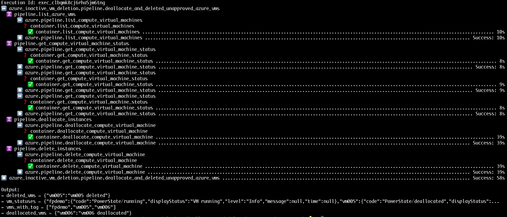

# Deallocate And Delete Unapproved Azure VMs

A composite Flowpipe mod that runs every day using Triggers. The mod lists Azure VMs with a specific Tag values and checks them against the Approved List. If a VM with the desired Tag value is in running state and unapproved then it is deallocated. If a VM with the desired Tag value is in stopped/deallocated state and unapproved then it is deleted.

## Usage

- Add your Azure keys (Tenant ID, Client secret, Client ID and Subscription ID, Resource group) to `flowpipe.pvars`
- Run the pipeline using `flowpipe pipeline run deallocate_and_deleted_unapproved_azure_vms`

