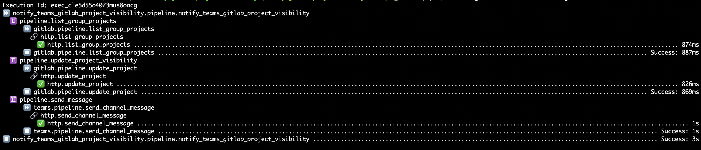

# Notify Teams on GitLab Public Projects, Optionally Update Public Projects To Private

Notify a Teams channel with GitLab Public Projects of a group. Optionally, update the public projects in the group to private.

## Usage

- Add your Microsoft Teams channel ID to `flowpipe.pvars`
- Add your GitLab and Microsoft Teams API tokens to `credential` resource in any `.fpc` file in the config directory (~/.flowpipe/config/*.fpc).
- Start your Flowpipe server
- Run the pipeline and specify `group_id` e.g., `flowpipe pipeline run notify_teams_gitlab_project_visibility --arg group_id=77637670 --arg teams_channel_id="19:P7fSYEJGuWSTHTfYAMAZEzIc1Uk8BTS-abcdnSV2H-A1@thread.tacv2"`

- You can update the public projects to private with `--arg action_public_to_private=true`

